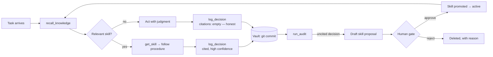

# Scout Compass

**A git-backed, Markdown-native blackbox flight recorder and skill auditor for autonomous AI agents.**

> Microsoft's new Autopilot agents are governed at the *permission* layer — identities, policies, approvals. Scout Compass governs the layer nobody else does: **memory and competence**. What does your agent know? What did it do, and why? How does it improve — and who approved that?

*Agents League @ AI Skills Fest 2026 · Reasoning Agents track · Microsoft Foundry + MCP*

---

## The problem

Autonomous agents act around the clock. When one makes a bad call, permission systems tell you it was *allowed* — not *why it happened*. And when agents "learn," that learning is invisible: buried in vendor-side memory you can't read, diff, or revoke.

## The idea

An agent's entire memory — skills, knowledge, decisions — lives as plain Markdown in a git repository the human owns. Obsidian-compatible. Every memory write is a commit.

- **Blackbox**: every action produces an immutable decision record — plan, evidence cited, actions, outcome, confidence. The git log *is* the audit trail.
- **Compass**: audit heuristics mine the decision records. Uncited decisions (the agent freelanced) automatically become *draft skill proposals*. A human approves or rejects. Approved skills change the agent's future behavior — auditable, attributable, revertible.

**The invariant (enforced by the server, not by prompt):** the agent's only write paths are decision records and proposals. Promotion into active skills/knowledge happens exclusively through the human-gated `approve_proposal`. **Agents propose; humans promote.** `git revert` is memory rollback — but it only applies to skills and knowledge: decision records are append-only even for humans. **Behavior is revertible; history is not.**

## The loop



## Architecture

```
Foundry Agent ("Atlas")  ──MCP (streamable HTTP)──►  Compass MCP Server (TypeScript)
   multi-step reasoning        9 tools                    │
                                                          ▼
Human ◄── Obsidian (live graph view) ◄────────────  Vault (git repo, Markdown)
        approves/rejects/reverts                    decisions · skills · knowledge · proposed
```

See `docs/architecture.svg` for the full diagram.

## Tools (MCP surface)

| Tool | Caller | Purpose |
|---|---|---|
| `recall_knowledge` | agent | keyword recall over knowledge + skills |
| `get_skill` | agent | fetch a skill's full procedure |
| `log_decision` | agent | write the blackbox record (only agent write path) |
| `run_audit` | human-triggered (via agent) | 3 heuristics: uncited decisions, stale skills, low-confidence repeats. For an uncited decision, Compass re-runs recall over the task and drafts a proposal that cites the existing notes the agent failed to consult — the draft is derived from real vault content, not invented |
| `list_proposals` | agent | show drafts awaiting review |
| `approve_proposal` | **human gate** | promote proposal → active memory |
| `reject_proposal` | **human gate** | delete with reason |
| `revert_memory` | **human gate** | `git revert` a `[compass]`/`[human]` commit. Refuses `[blackbox]` commits: the flight recorder is append-only |
| `memory_log` | anyone | the audit trail itself |

## Quickstart

```bash
cd server && npm install && npm run build
node ../demo/seed-vault.mjs            # generates the demo vault (it is not committed —
                                       # it contains its own inner git repo, recreated deterministically)
npm start                              # stdio (Claude Desktop / MCP Inspector)
MODE=http npm start                    # streamable HTTP :3000/mcp (Foundry)
node ../demo/smoke-test.mjs            # full loop, no LLM required — exits 0 only if every check passes
```

Wire a Foundry Agent Service agent to `https://<host>/mcp` with the
instructions in `agent/atlas-instructions.md`, point Obsidian at `vault/`,
and run the demo script in `demo/`.

## How this maps to the judging criteria

- **Reasoning / multi-step (20%)** — the full loop on video: plan → recall → act → log → audit → propose → human approve → governed re-run of the same input. The improvement step is itself reasoning you can read: the audit's proposal cites the exact notes the agent overlooked.
- **Reliability & safety (20%)** — the invariant is enforced in the tool layer, not the prompt: no tool writes active memory; promotion requires the human gate; `revert_memory` refuses to rewrite the blackbox; honest empty citations are a designed signal, never "fixed" server-side; all vault writes are serialized and committed.
- **Accuracy (20%)** — citations are server-verified: ids that don't resolve to a real note are flagged `citations_unresolved` in the record (never silently dropped), and `cite_count`/`last_cited` are updated server-side from logged citations, not agent claims.
- **Creativity (15%)** — agent memory as a human-owned git repo: the git log is the audit trail, `git revert` is rollback, Obsidian is the UI.
- **UX (15%)** — plain Markdown, live graph view, one-call approval; zero new interfaces to learn.

## Why this matters beyond a demo

Regulated industries — healthcare first — cannot deploy autonomous agents
without exactly this: decision provenance, human-gated capability change, and
revocable memory. Scout Compass is the pattern, in 100% inspectable plain text.

## The bigger picture

Scout Compass spans the full skill lifecycle. A companion authoring toolkit,
[Scout-Compass / skill-forge](https://github.com/JeremyGracey-AI/Scout-Compass),
handles how skills are *born* — build → preview → install. **This repository
(`scout-compass-mcp`) governs how an agent *uses and improves* them at
run-time**, and is the Agents League hackathon entry. Same principle end to
end: humans approve what agents propose.

## Stack

TypeScript · MCP SDK (streamable HTTP + stdio) · Microsoft Foundry Agent Service · simple-git · gray-matter · Obsidian-compatible vault

---

Built solo by [Jeremy Gracey](https://jeremygracey.ai) · [GitHub](https://github.com/JeremyGracey-AI)
